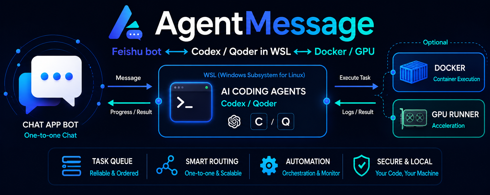

<p align="center">
  
</p>

<p align="center">
  <a href="README.md">En</a> | <a href="README_CN.md">Cn</a>
</p>

<p align="center">
  
  
  
  
  
  
  
  <a href="LICENSE"></a>
</p>

AgentMessage 通过飞书长连接，把机器人单聊消息交给 WSL/Linux 中的 Codex CLI 或 Qoder CLI，再将任务进度和结果发回飞书；不需要公网 IP、端口或回调 URL。

## 主要功能

- **飞书远程开发**：发送任务、接收进度与结果，无需公网 IP 或开放端口。
- **Codex 与 Qoder**：按项目选择 Agent，可在终端继续同一个会话。
- **持久对话与任务管理**：任务排队、状态查询、日志查看和停止；不同项目可并行执行。
- **模型控制**：切换 Codex 模型和思考强度，压缩上下文并保留会话。
- **Bubblewrap 沙箱与 Docker**：任意项目都能启用受控沙箱并获得可写的 Git 元数据，GPU 透传按项目单独开启。
- **访问控制**：用户授权与项目白名单，限定可操作范围。

## 配置飞书

进入[飞书开放平台开发者后台](https://open.feishu.cn/app)：

1. 创建企业自建应用并添加机器人能力。
2. 开通 `im:message.p2p_msg:readonly` 和 `im:message:send_as_bot` 权限。
3. 在事件订阅中选择“使用长连接接收事件”，添加 `im.message.receive_v1`。
4. 创建并发布应用版本，将机器人可用范围限制为自己。
5. 保存 App ID 和 App Secret；安装脚本稍后会在终端中询问，Secret 输入不会回显。

## 一键安装

需要 curl、Ubuntu/WSL 或常见 systemd Linux，以及至少一个已安装的 Codex CLI 或 Qoder CLI。Agent CLI 登录仍使用各自的官方命令：

```bash
codex login       # 使用 Codex 时
qodercli login    # 使用 Qoder 时
```

从 HTTPS 下载安装脚本并运行：

```bash
curl -fsSLo /tmp/agent-message-install.sh \
  https://raw.githubusercontent.com/wenqing-2021/AgentMessage/main/install.sh &&
bash /tmp/agent-message-install.sh
```

脚本负责安装 AgentMessage、录入飞书凭证并启动后台服务，默认目录为 `~/workspace/AgentMessage`。安装中断后可重新运行继续。

自定义安装目录时使用：

```bash
bash /tmp/agent-message-install.sh --install-dir /absolute/path/AgentMessage
```

如果 systemd 已安装但尚未在 WSL 中启用，脚本会暂停并给出 `/etc/wsl.conf` 和 `wsl --shutdown` 提示；重新打开 WSL 后再次运行即可继续。

## 项目配置

安装脚本会先把 AgentMessage 仓库本身注册为默认项目。添加自己的项目时编辑：

```bash
vim ~/workspace/AgentMessage/config/projects.toml
```

最小项目配置：

```toml
[service]
state_dir = "var"
log_dir = "var/logs"
default_chat_project = "website"
codex_tool_network = false

[projects.website]
path = "/home/alice/workspace/website"
default_agent = "qoder"
allowed_agents = ["codex", "qoder"]
```

- `path` 必须是本机存在的绝对路径，飞书消息不能提交任意路径。
- `default_agent` 必须包含在 `allowed_agents` 中，支持 Codex-only、Qoder-only 或二者并存。
- `codex_tool_network = true` 才会允许普通 Codex 工具联网；Qoder 普通 Bash 默认可以联网。
- 完整字段见 [`config/projects.example.toml`](config/projects.example.toml)。
- 隔离执行、Git 写入和可选 GPU/CUDA/JAX 见 [Bubblewrap 沙箱指南](assets/docs/sandbox-bubblewrap.md)。

修改配置后使用 README 最后的重启命令。

## 首次授权

安装完成后，在飞书中给机器人发送 `/help`，再在终端查看并授权自己的 `open_id`：

```bash
cd ~/workspace/AgentMessage
uv run agent-message pending-senders
uv run agent-message authorize ou_xxx
```

再次发送 `/help`，收到回复即表示连接完成。只授权自己的账号。

查看服务与日志：

```bash
systemctl --user status agent-message --no-pager
journalctl --user -u agent-message -f
```

## 飞书命令

普通文本会继续当前任务；没有当前任务时，会使用默认项目的 `default_agent` 创建长期对话。

```text
/new website <任务描述>
/new website --agent qoder <任务描述>
/chat
/model
/model <模型名称>
/model 1
/model next
/model prev
/model 1 high
/model effort high
/model effort default
/compact
/use a1b2c3d4
/status
/status a1b2c3d4
/logs a1b2c3d4 50
/logs a1b2c3d4 50 sandbox
/logs a1b2c3d4 50 container
/stop a1b2c3d4
/send reports/result.png
/help
```

`/send` 把当前任务项目内的文件发送到飞书对话：图片（png/jpg/jpeg/gif/webp/bmp）以图片消息展示，其他格式以文件消息发送。路径必须位于项目目录内；图片不超过 10MB，其他文件不超过 30MB。

也可以直接给机器人发送图片或文件消息：它们会被下载到项目的 `.agent-message/inbox/` 目录，并把路径交给 Agent，宿主机、Bubblewrap 沙箱和 bind mount 的容器内都能读取。大小限制相同；该目录不会自动清理，建议在项目的 `.gitignore` 中忽略 `.agent-message/`。

Agent 发送项目文件使用 bridge 注入到项目内的脚本：

```bash
sh .agent-message/bin/send-to-feishu reports/result.png
```

脚本把请求写入 `.agent-message/outbox/` 并等待 bridge 处理；上传由 bridge 用自己的凭证完成，Agent 及其 shell 不会拿到飞书凭证。发送成功时脚本输出「已发送」并以 0 退出，失败时以非零退出并给出原因。限制相同：仅限项目内文件，图片 10MB、其他文件 30MB。如需让 Agent 主动使用，可在项目的 `AGENTS.md` 中写清这条调用约定。与 `/send` 不同，这条路径不进入 durable outbox，是立即执行的传输，结果由 Agent 在自己的回复中转述。

`/model` 查看模型和思考强度；按名称或编号选择模型，使用 `next` / `prev` 循环切换。`/model 1 high` 同时设置模型与强度，`/model effort high` 只改强度，`/model effort default` 恢复默认强度。这些全局 Codex 设置重启后保留，从下一轮生效。

`/compact` 压缩当前 Codex 对话的上下文并保留会话；正在执行时，会等待当前轮次完成。

在终端恢复飞书创建的同一个 Codex/Qoder session：

```bash
cd ~/workspace/AgentMessage
uv run agent-message resume a1b2c3d4
```

## 沙箱 Git 配置

为所有 Bubblewrap 沙箱项目统一配置 Git 提交者身份与 SSH 认证：

```bash
cd ~/workspace/AgentMessage
uv run python scripts/configure_sandbox_git.py
```

WSL 启动时自动拉起 SSH agent：`install.sh` 会默认安装并启用[专用用户服务](assets/docs/sandbox-bubblewrap.md#wsl-启动时自动启动-ssh-agent)，无需手动复制文件；需要更新 unit 时执行 `bash install.sh --refresh-service`。该服务会扫描 `~/.ssh` 并加载所有无需口令的私钥，再启动 AgentMessage；linger 仍需用户自行开启。

SSH push/pull 需先准备专用 SSH agent 和已验证的 `known_hosts` 文件，保存配置后重启 AgentMessage。准备步骤与排错见 [沙箱指南](assets/docs/sandbox-bubblewrap.md)。容器 Git 认证需在容器内单独配置。

## Docker 项目

在已有 Docker 容器中执行项目命令。容器需把宿主项目目录以读写方式 bind mount 到 `container_path`：

```toml
[projects.container_project]
path = "/home/alice/workspace/container_project"
default_agent = "qoder"
allowed_agents = ["codex", "qoder"]
container_name = "container_project_dev"
container_path = "/workspace/container_project"
container_auto_start = true
container_timeout_seconds = 86400
```

```bash
cd ~/workspace/AgentMessage
uv run agent-message doctor --container container_project
```

容器项目不能同时启用 Bubblewrap 沙箱。Qoder 不会获得宿主 Bash，只能使用受控的 `container_run`；Docker socket 只应开放给可信的 AgentMessage 服务用户。

## 卸载

从仓库外运行卸载脚本：

```bash
cd ~
bash ~/workspace/AgentMessage/uninstall.sh
```

卸载 AgentMessage 及其服务，可选择备份配置、任务记录、日志和凭证。备份询问直接回车默认不备份。

## 安全与二次开发

- 飞书凭证只保存在仓库外，且不会传给 Codex/Qoder 子进程。
- 只注册允许 Agent 修改的项目；完整 JSONL 和命令日志保存在本地 `var/logs/`。
- 架构边界、模块扩展和测试要求见 [`AGENTS.md`](AGENTS.md)。

```bash
cd ~/workspace/AgentMessage
uv run agent-message doctor
uv run agent-message tasks
```

## 更新与重启

```bash
cd ~/workspace/AgentMessage

# 代码更新：拉取代码、同步依赖、重启两个服务，并打印服务状态与已加载密钥
bash update.sh

# deploy/ 中的 service 有改动时（update.sh 会自动判断并执行）
bash install.sh --refresh-service

# 只改了 config/projects.toml 或 feishu.env
systemctl --user restart agent-message

# 需要更完整的检查（配置、Agent CLI、沙箱、Docker）时
uv run agent-message doctor
```

### 飞书与 Codex Chats 会话同步

在仓库目录运行以下两个命令即可，无需查找 Codex UUID：

```bash
uv run sync-feishu-to-codex <飞书任务ID>
uv run sync-codex-to-feishu "Chats 中的对话标题"
```

飞书 `/list` 只显示当前项目最新创建的 5 个未归档 Codex Chats 标题；当前任务 ID 用 `/status` 查看，同步支持完整或部分标题。
可直接问 Agent“列出当前项目最近 5 个 Codex Chats 标题”，无需 UUID；也可让 Agent“把当前对话同步到 Codex”或“把 Chats 里的《标题》同步到飞书”；bridge 在本轮结束后执行并通知结果，导入后用 `/use <任务ID>` 继续。
