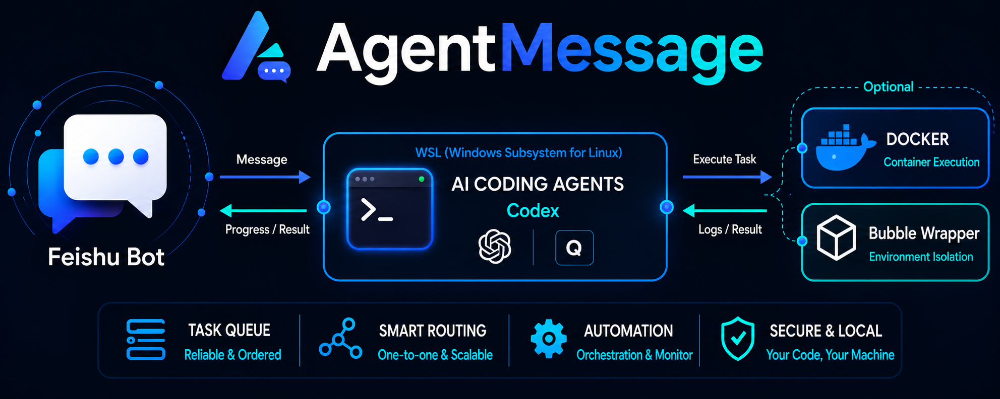

<p align="center">
  
</p>

<p align="center">
  <a href="README.md">En</a> | <a href="README_CN.md">Cn</a>
</p>

<p align="center">
  
  
  
  
  
  
  
  <a href="LICENSE"></a>
</p>


AgentMessage 把飞书单聊接入 WSL/Linux 中的 Codex CLI，在指定项目中执行任务并回传进度、结果和文件。使用长连接，无需公网 IP 或开放端口。

## 1. 主要功能

- **任务管理**：持续对话、任务切换、排队、日志和停止；不同项目并行执行。
- **模型控制**：切换模型与思考强度，原生压缩上下文，保留会话。
- **文件收发**：发送图片或文件给 Agent，也可让 Agent 回传项目文件。
- **会话互通**：终端接续任务，飞书与 Codex Chats 双向同步。
- **隔离执行**：Bubblewrap 沙箱、可选 GPU 透传，或已有 Docker 容器。
- **多机器人**：共用代码，独立分配项目和授权用户。

## 2. 配置飞书

进入[飞书开放平台](https://open.feishu.cn/app)：

1. 创建企业自建应用，添加机器人能力。
2. 在权限管理中批量导入以下 JSON。
3. 事件订阅选择“使用长连接接收事件”，添加 `im.message.receive_v1`。
4. 发布应用版本，将可用范围限制为自己。
5. 保存 App ID 和 App Secret，安装时按提示输入。

```json
{
  "scopes": {
    "tenant": [
      "docs:document.comment:create",
      "docs:document.comment:read",
      "docx:document",
      "im:message.p2p_msg:readonly",
      "im:message:send_as_bot",
      "im:resource"
    ],
    "user": []
  }
}
```

## 3. 一键安装

需要 curl、已启用 systemd 的 WSL/Linux，以及已安装并登录的 Codex CLI。

```bash
curl -fsSLo /tmp/agent-message-install.sh \
  https://raw.githubusercontent.com/wenqing-2021/AgentMessage/main/install.sh &&
bash /tmp/agent-message-install.sh
```

按提示输入飞书凭证，脚本自动安装并启动服务。默认目录：`~/workspace/AgentMessage`。
重复安装、修改凭证或新增机器人见[安装说明](assets/docs/installation.md)。

## 4. 项目配置

编辑 `config/projects.toml`。下面按当前配置展示，身份、项目名和路径已替换为示例值：

```toml
[service]
feishu_app_id = "cli_example"
state_dir = "var"
log_dir = "var/logs"
default_chat_project = "agent_message"
codex_tool_network = true
stop_grace_seconds = 10
final_message_limit = 3500
sandbox_git_user_name = "Alice"
sandbox_git_user_email = "alice@example.com"
sandbox_ssh_agent_socket = "/run/user/1000/agent-message-ssh/agent.sock"
sandbox_ssh_known_hosts = "/home/alice/.ssh/known_hosts"
sandbox_readonly_paths = ["/etc/fonts"]

[projects.agent_message]
path = "/home/alice/workspace/AgentMessage"
default_agent = "codex"
allowed_agents = ["codex"]
sandbox_enabled = true
sandbox_network = true
sandbox_timeout_seconds = 86400
sandbox_gpu = true

[projects.container_project]
path = "/home/alice/workspace/ContainerProject"
default_agent = "codex"
allowed_agents = ["codex"]
container_name = "project_dev"
container_path = "/root/workspace/ContainerProject"
container_auto_start = true
container_timeout_seconds = 86400

[bots.cli_example]
projects = ["agent_message", "container_project"]
default_chat_project = "agent_message"
```

替换 App ID、路径和 Git/SSH 信息；只保留需要的项目，并同步调整 `[bots]` 中的项目列表。路径必须存在，`sandbox_readonly_paths` 中不需要的条目应删除。
沙箱、GPU、Git/SSH 和 Docker 配置见[运行环境说明](assets/docs/runtimes.md)；完整字段见[配置示例](config/projects.example.toml)。保存后重启对应服务。

## 5. 首次授权

在飞书给机器人发送 `/help`，再在终端授权自己的账号：

```bash
cd ~/workspace/AgentMessage
uv run agent-message pending-senders
uv run agent-message authorize ou_xxx
```

再次发送 `/help`，收到回复即完成。

## 6. 命令参考

[飞书与 Terminal 命令](assets/docs/commands.md)

## 7. 未来开发计划

- [ ] 支持自动上传飞书云文档。
- [ ] Agent 额度查询。
- [ ] Monitor 监控等功能。
